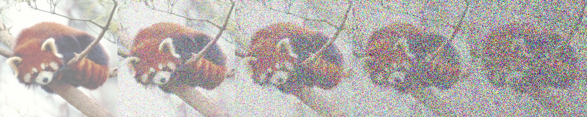
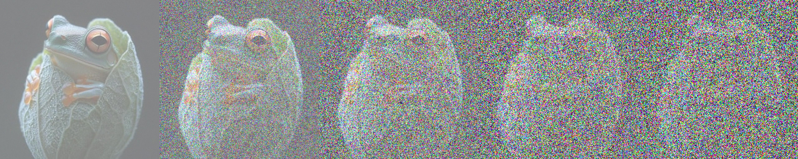
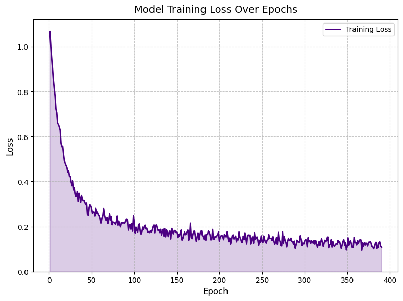
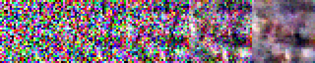
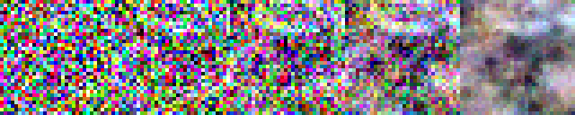
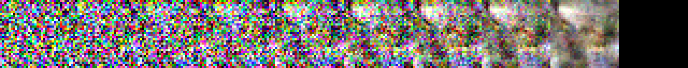
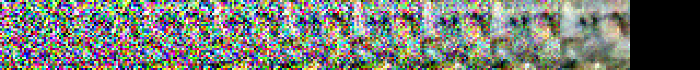
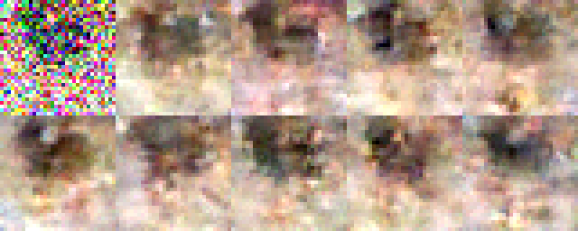
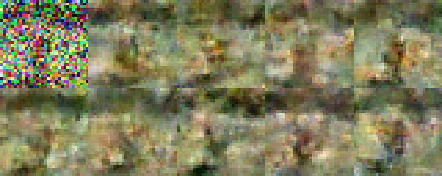

# U-Net Denoising Diffusion Probabilistic Model (DDPM)

Denoising Diffusion Probabilistic Model (DDPM) using a U-Net architecture.

[U-Net architecture] 

  
Table of Contents

  <ul style="list-style-type: circle;">
    <li><a href="#u-net-denoising-diffusion-probabilistic-model-ddpm">U-Net Denoising Diffusion Probabilistic Model (DDPM)</a>
      <ul style="list-style-type: circle;">
        <li><a href="#model-performance">Model Performance</a>
          <ul style="list-style-type: circle;">
            <li><a href="#diffusion-process">Diffusion Process</a></li>
            <li><a href="#training-progress">Training Progress</a></li>
            <li><a href="#gradual-denoising-process">Gradual Denoising Process</a></li>
            <li><a href="#heavy-noise-recovery">Heavy Noise Recovery</a></li>
          </ul>
        </li>
        <li><a href="#architecture">Architecture</a>
          <ul style="list-style-type: circle;">
            <li><a href="#u-net-model">U-Net Model</a></li>
            <li><a href="#diffusion-process-1">Diffusion Process</a></li>
          </ul>
        </li>
        <li><a href="#model-components">Model Components</a>
          <ul style="list-style-type: circle;">
            <li><a href="#time-embedding">Time Embedding</a></li>
            <li><a href="#residual-blocks">Residual Blocks</a></li>
            <li><a href="#u-net-structure">U-Net Structure</a></li>
          </ul>
        </li>
      </ul>
    </li>
  </ul>

## Model Performance

### Diffusion Process 

### Training Progress

*Training loss*

### Gradual Denoising Process

*Progressive denoising steps demonstrating the model's ability to recover image details*

### Heavy Noise Recovery

*Recover images from heavily corrupted inputs*

> **Note:** The model demonstrates pattern recognition capabilities, though its full potential is limited by computational resources. With increased computing power, the model could achieve more refined results and faster convergence.

## Architecture

### U-Net Model
- Custom U-Net architecture optimized for diffusion models
- Time-conditional generation through sinusoidal time embeddings
- Residual blocks with group normalization and Swish activation
- Multi-scale feature processing with skip connections
- Configurable channel multipliers and attention layers

### Diffusion Process
- Denoising diffusion probabilistic model (DDPM)
- Linear noise schedule with configurable parameters
- Forward and reverse diffusion processes
- Stochastic sampling with learned noise prediction

## Model Components

### Time Embedding
- Sinusoidal positional encoding
- Multi-layer perceptron for time step processing
- Swish activation for non-linear transformations

### Residual Blocks
- Group normalization for stable training
- Time-conditional convolutions
- Skip connections for gradient flow
- Swish activation functions

### U-Net Structure
- Downsampling path with residual blocks
- Middle block for feature processing
- Upsampling path with skip connections
- Final convolution for image reconstruction

