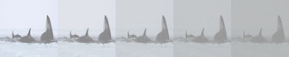

# U-Net Denoising Diffusion Probabilistic Model (DDPM)

Diffusion model for image generation. 

[U-Net architecture] 

## Architecture

### U-Net Model
- Custom U-Net architecture optimized for diffusion models
- Time-conditional generation through sinusoidal time embeddings
- Residual blocks with group normalization and Swish activation
- Multi-scale feature processing with skip connections
- Configurable channel multipliers and attention layers

### Diffusion Process
- Denoising diffusion probabilistic model (DDPM)
- Linear noise schedule with configurable parameters
- Forward and reverse diffusion processes
- Stochastic sampling with learned noise prediction

## Model Components

### Time Embedding
- Sinusoidal positional encoding
- Multi-layer perceptron for time step processing
- Swish activation for non-linear transformations

### Residual Blocks
- Group normalization for stable training
- Time-conditional convolutions
- Skip connections for gradient flow
- Swish activation functions

### U-Net Structure
- Downsampling path with residual blocks
- Middle block for feature processing
- Upsampling path with skip connections
- Final convolution for image reconstruction

## Examples

### Diffusion Process 

